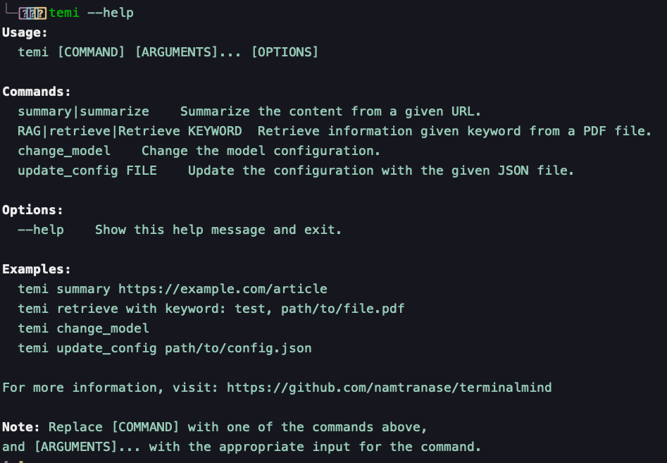

# terminalmind

<p align="center">
  
</p>

**Latest Version: v1.0.2**

[](https://opensource.org/licenses/MIT)

Enhance your coding and command-line efficiency with `terminalmind`, now known as `temi`. Get relevant code snippets, process text and PDF data without leaving your terminal, and maintain a seamless workflow.


### TODO

[] Add the python packaging version for better user experience

[] Add the llamacpp server version for better optimization

[] Add the database assistant version

### 🚀 What's New

- Simplified configuration via `config.json`
- Enhanced helper interface for user commands
- Cleaner and more accessible documentation

Explore the [release notes](https://github.com/namtranase/terminalmind/releases/tag/v1.0.2) for more details.

## 🙏 Acknowledgments

A huge shoutout to [Georgi Gerganov](https://github.com/ggerganov) and all contributors of [llama.cpp](https://github.com/ggerganov/llama.cpp) for their pioneering work.


## ✨ Supported Features

Demo:
<p align="center">
  
</p>

- **Q&A in Terminal**: Get instant answers within your command line.
- **PDF Information Retrieval**: Delve into PDFs for the info you need.
- **Online Article Summarization**: Summarize articles in commands.
- **llama.cpp Integration**: Multiple model support for extended capabilities.
- **User-Friendly Settings**: A simple JSON config caters to all use cases.
- *Upcoming*: Command execution, GPU acceleration, llama.cpp server integration, app and web launcher, and Docker support.


## 📖 Description

`temi` is your go-to CLI companion for quick text summarization, efficient content retrieval, and more. It's an indispensable tool for developers, researchers, and anyone who loves efficiency.

## 🛠 Installation

Clone the repository:
```bash
git clone https://github.com/namtranase/terminalmind.git
cd terminalmind
# Install requirement packages
sudo apt install python3-requests python3-bs4 python3-pypdf2 jq
# Download the model
./scripts/download_model.sh
#Install the package by scripts:
./scripts/install_temi.sh
```

Optionally, build and install the Debian package manually:

```bash
dpkg-deb --build temi-packaging temi.deb
sudo dpkg -i temi.deb
```

## 🖥 Usage
For the first time, you can call helper for better understand the functions of temi:
```bash
temi --help
```
<p align="center">
  
</p>

Use temi for a variety of tasks:
```bash
temi how to make a python package
#  To create a Python package, follow these steps:

# 1. Choose a name for your package and ensure it's unique.
# 2. Create a new directory with that name.
# 3. Inside the directory, create a file named `__init__.py` to mark the directory as a Python package.
# 4. Write your Python code in subdirectories or files inside the package directory.
# 5. Install any required dependencies in a `requirements.txt` file or `setup.py`.
# 6. To distribute, use tools like setuptools, Twine and PyPI to create a distribution package.%

```
## 🤝 Contributing

We welcome contributions!

### Quick Start for Contributors
For detailed instructions on working with the llama.cpp submodule, including setup and usage, refer to the WORK_WITH_LLAMACPP.md file.

1. Install repo and submoudles:
```bash
git clone --recurse-submodules https://github.com/namtranase/terminalmind.git
```

2. Install Development Dependencies:
```bash
pip install -r requirements/dev_requirements.txt
```

3. Set Up Pre-Commit Hooks:
```bash
pre-commit install
```

## License

`terminalmind` is MIT licensed, as found in the [LICENSE](https://github.com/namtranase/terminalmind/LICENSE) file.
