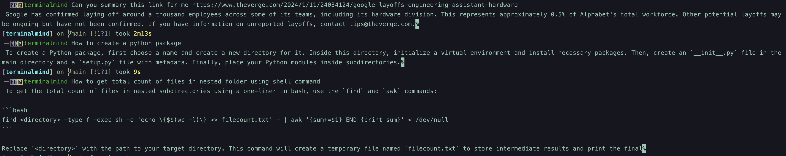

# terminalmind

<p align="center">
  
</p>

[](https://opensource.org/licenses/MIT)

`terminalmind`, now accessible via the `temi` command, is a command-line tool designed to enhance coding efficiency by suggesting relevant code snippets and facilitating text and PDF data processing directly in the terminal. This approach promotes a seamless development workflow, keeping developers focused within their coding environment.

## Acknowledgments

`terminalmind` builds on the work of the [llama.cpp](https://github.com/ggerganov/llama.cpp) project. Special thanks to [Georgi Gerganov](https://github.com/ggerganov) and contributors for their groundbreaking work in creating a C++ interface for the LLM model. We encourage `terminalmind` users and developers to support and contribute to `llama.cpp`.

### Supported Features

Examples:
<p align="center">
  
</p>

- [x] Q&A in terminal
- [x] Retrieval of information from local or web-based PDF files
- [x] Summary of online articles
- [ ] Executing terminal commands based on user input

----

<details>
  <summary>Table of Contents</summary>
  <ol>
    <li><a href="#description">Description</a></li>
    <li><a href="#installation">Installation</a></li>
    <li><a href="#usage">Usage</a></li>
    <li><a href="#contributing">Contributing</a></li>
    <li><a href="#license">License</a></li>
  </ol>
</details>

## Description

`terminalmind`, accessible via the `temi` command, offers functionalities like text summarization, content retrieval from PDFs, and more, using an integrated language model. Designed for terminal use, it caters to developers, researchers, and technology enthusiasts.

## Installation

Clone the repository:
```bash
git clone https://github.com/namtranase/terminalmind.git
cd terminalmind
pip install -r requirements.txt
```

Download the model:
```bash
./scripts/download_model.sh
```

Install the package by scripts:
```
./scripts/install_temi.sh
```

Or build step by step.

Build the Debian package:
```bash
dpkg-deb --build temi-packaging temi.deb
```

Install package using `dpkg`:
```bash
sudo dpkg -i temi.deb
```

## Usage

After installation, you can use temi but first, it needs to update the model file. Start temi for the first time and paste the absolute path to the model downloaded above. For example:
```bash
temi Hello
# Model file not found at /llm_models/model.gguf.
# Please enter the absolute path to your .gguf model file:
models/model.gguf

And now you can use `temi` as the terminal assistant:
```bash
temi how to make a python package
#  To create a Python package, follow these steps:

# 1. Choose a name for your package and ensure it's unique.
# 2. Create a new directory with that name.
# 3. Inside the directory, create a file named `__init__.py` to mark the directory as a Python package.
# 4. Write your Python code in subdirectories or files inside the package directory.
# 5. Install any required dependencies in a `requirements.txt` file or `setup.py`.
# 6. To distribute, use tools like setuptools, Twine and PyPI to create a distribution package.%

```
## Contributing

We welcome contributions to terminalmind. Please refer to our contributing guidelines for submitting pull requests, reporting bugs, and suggesting enhancements.

## License

`terminalmind` is MIT licensed, as found in the [LICENSE](https://github.com/namtranase/terminalmind/LICENSE) file.